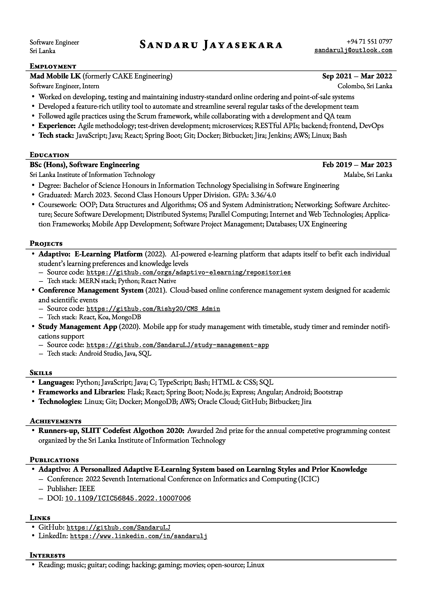

# Modest CV
Modest CV is a LuaLaTeX template for creating clean, simple CVs.

This template is based on the excellent [McDowell CV](https://github.com/dnl-blkv/mcdowell-cv) template, with some slight modifications (listed below). This project was originally intended to simply version control my own CV (still is), but anyone can easily create their own CV by just modifying the content. Feel free to try!

## Modifications
Slight modifications were made to the original [McDowell CV](https://github.com/dnl-blkv/mcdowell-cv) template, as listed below:
- Default paper format: A4
- Default font: EB Garamond
- `cvsubsection`: Changed the three-column title format to two-columns, with subtitles.
- Added support for hyperlinks with `hyperref` package.

## Sample
<kbd></kbd>

The content of this CV might not be great (I'm still learning, ya know), so don't refer to them as a good example. Just use the template and the style!

## Usage
### Traditional Method
The template can be used like any other LuaLaTeX template by editing the content as necessary and compiling with the `lualatex <file-name.tex>` command. For more information, refer to the [mcdowell-cv](https://github.com/dnl-blkv/mcdowell-cv#build-instructions) repo.
### Dev Container
A VS Code dev container configuration is included with the project. It is configured so the CV can be edited, compiled and reviewed with maximum convenience (this is how I do it!).

The configurations are as follows:
- Makes use of the [LaTeX Workshop](https://marketplace.visualstudio.com/items?itemName=James-Yu.latex-workshop) VS Code extension (automatically build and review the CV while editing).
- Includes a basic TeX Live setup with additional packages needed for the template (intended as a dependency of the above extension, but the tools can be accessed with the terminal too, if needed)
- **Fonts**
  - When building the dev container, the fonts inside the `.devcontainer/fonts` directory are copied in. They are used when compiling the CV.
  - If you want to use any custom fonts, just copy them to the `.devcontainer/fonts` directory and rebuild the dev container. The new fonts will be available inside the container.

The `Dockerfile` of the image used for the dev container can be found [here](https://github.com/SandaruLJ/dockerfiles) (See `texlive-basic`).

## Credits
- [Daniil Belyakov](https://github.com/dnl-blkv) for the [McDowell CV](https://github.com/dnl-blkv/mcdowell-cv) template, and the inspiration.
